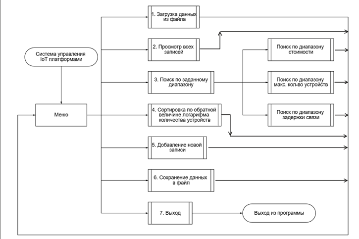

# Курсовая работа: База данных "IoT платформы"

## 🧮 Алгоритм работы программы
1.	**Загрузка данных из файла** - чтение ранее сохраненной базы данных из бинарного файла
2.	**Просмотр всех записей** - отображение полного содержимого базы данных в табличном формате
3.	**Поиск по заданному диапазону** - поиск записей по одному из трех критериев:
•	Стоимость одного устройства
•	Максимальное количество поддерживаемых устройств
•	Задержка связи
4.	**Сортировка по обратной величине логарифма количества устройств** - упорядочивание записей с применением математического преобразования
5.	**Добавление новой записи** - интерактивный ввод данных о новой IoT-платформе
6.	**Сохранение данных в файл** - запись текущего состояния базы в бинарный файл
7.	**Выход из программы** - завершение работы приложения

# Блок-схема диалога с пользователем

## 👤 Автор
**Чапэ Максим Сергеевич**

Группа: бТИИ-251
